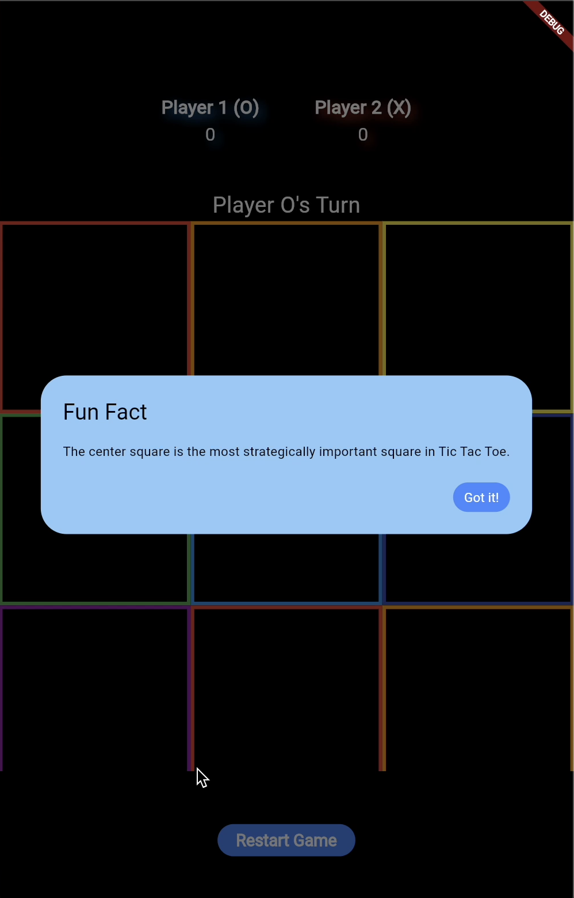
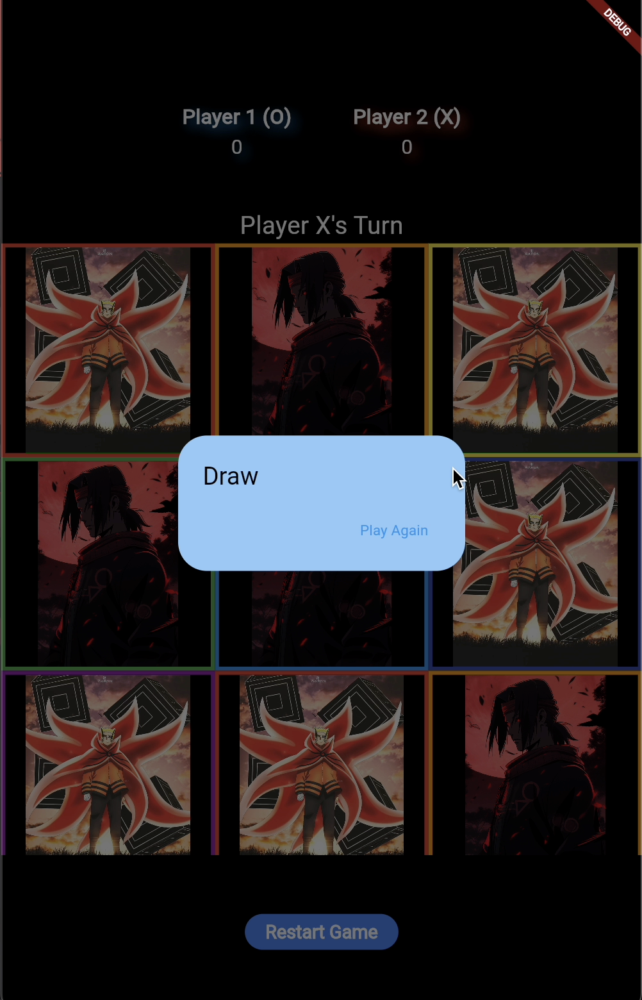
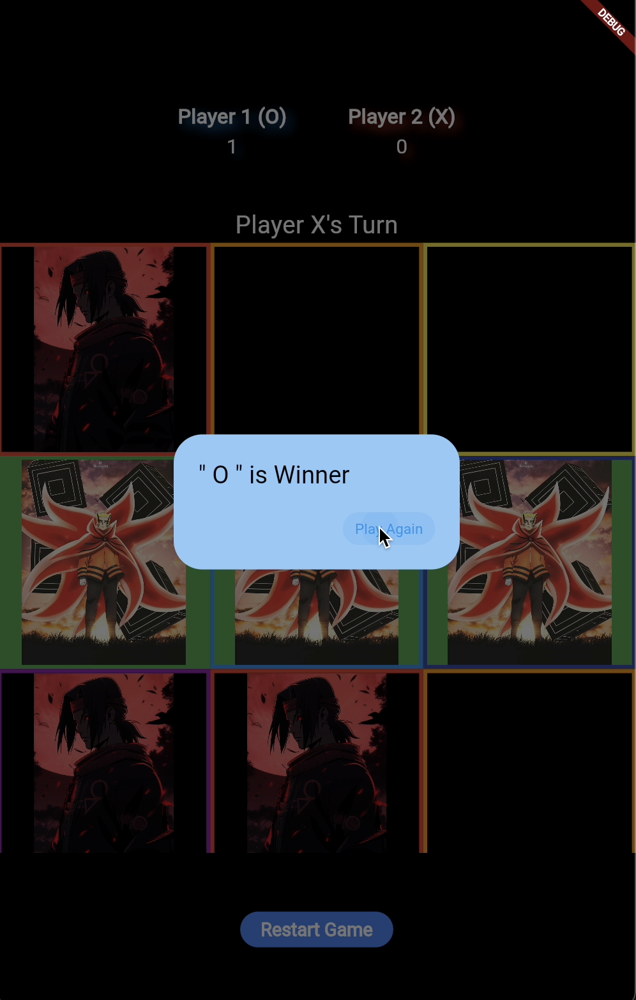
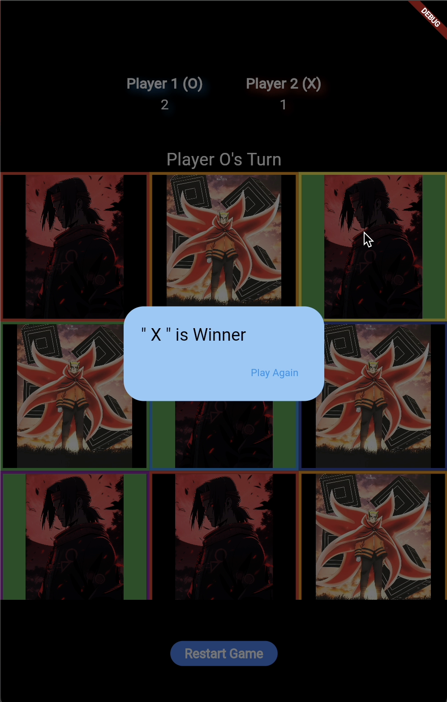
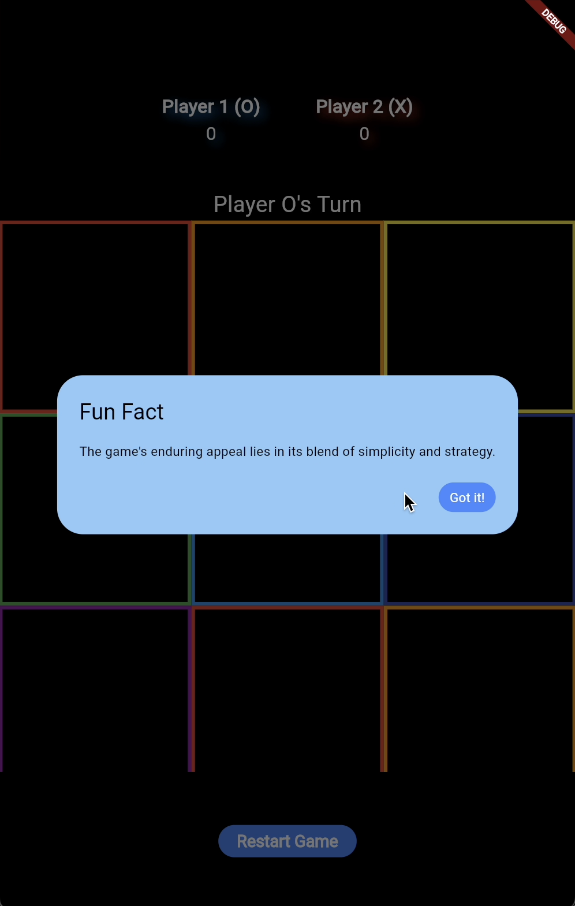

# Custom Tic-Tac-Toe Flutter App

This is a custom implementation of the classic Tic-Tac-Toe game using Flutter. Each player uses a custom image as their marker instead of the traditional X and O. The game includes a header, player scores, clickable game board, animations for winning combinations, and fun facts.

## Features

- Custom images for player markers (Player 1 uses `o_image.png` and Player 2 uses `x_image.png`).
- Header with game title.
- Score tracking for both players.
- Interactive Tic-Tac-Toe board.
- Animated indication of the winning combination.
- Fun fact dialog displayed at the start and after restarting the game.
- Restart game functionality with score reset.

## Demo Video

Watch the video below to see the app in action:

[]

## Screenshots

### Landing Page
The game starts with a fun fact about Tic Tac Toe.


### Draw Scenario
When the game ends in a draw.


### Player 1 Wins
Player 1 (O) wins the game.


### Player 2 Wins
Player 2 (X) wins the game.


### Game Restart
The game resets the score and displays a new fun fact.


## Getting Started

### Prerequisites

- Flutter SDK: [Install Flutter](https://flutter.dev/docs/get-started/install)
- Dart SDK: Included with Flutter installation.

### Installation

1. **Clone the repository:**

    ```bash
    git clone https://github.com/usename/Tic_Tac_Toe_app.git
    ```

2. **Install dependencies:**

    ```bash
    flutter pub get
    ```

3. **Add custom images:**

    Ensure you have the following image files in the `assets` directory:
    - `assets/o_image.png`
    - `assets/x_image.png`

    Add the following to your `pubspec.yaml`:

    ```yaml
    flutter:
      assets:
        - assets/o_image.png
        - assets/x_image.png
    ```

4. **Run the app:**

    ```bash
    flutter run
    ```

## Project Structure

- `lib/main.dart`: Main entry point of the app.
- `assets/`: Directory for storing custom images used for player markers.
- `pubspec.yaml`: Configuration file for Flutter dependencies and assets.

## How to Play

- The game starts with Player 1 (O) and alternates between players.
- Tap on an empty cell to place your marker.
- The game will automatically check for a winner after each move.
- If there is a winning combination, the winning cells will be highlighted, and a dialog will show the winner.
- If all cells are filled and there is no winner, a draw dialog will be displayed.
- Click "Restart Game" to reset the board and scores.

## Customization

- **Change Player Images**: Replace `assets/o_image.png` and `assets/x_image.png` with your preferred images.
- **Modify Fun Facts**: Update the `funFacts` list in `lib/main.dart` to display different fun facts.

## Language Breakdown

This project primarily uses Dart for the implementation of the Tic Tac Toe game. However, you might notice the presence of C++ and CMake in the language breakdown. This is due to some dependencies and build scripts used by Flutter to support native functionalities. The core logic and UI of the game are entirely implemented in Dart.

## Acknowledgements

- Flutter documentation: [flutter.dev](https://flutter.dev/)
- Inspiration from classic Tic-Tac-Toe game.
